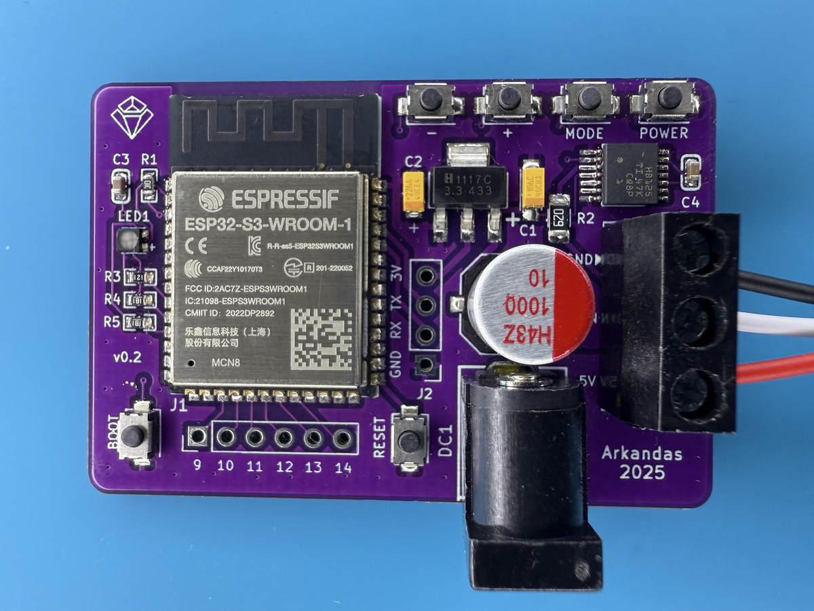
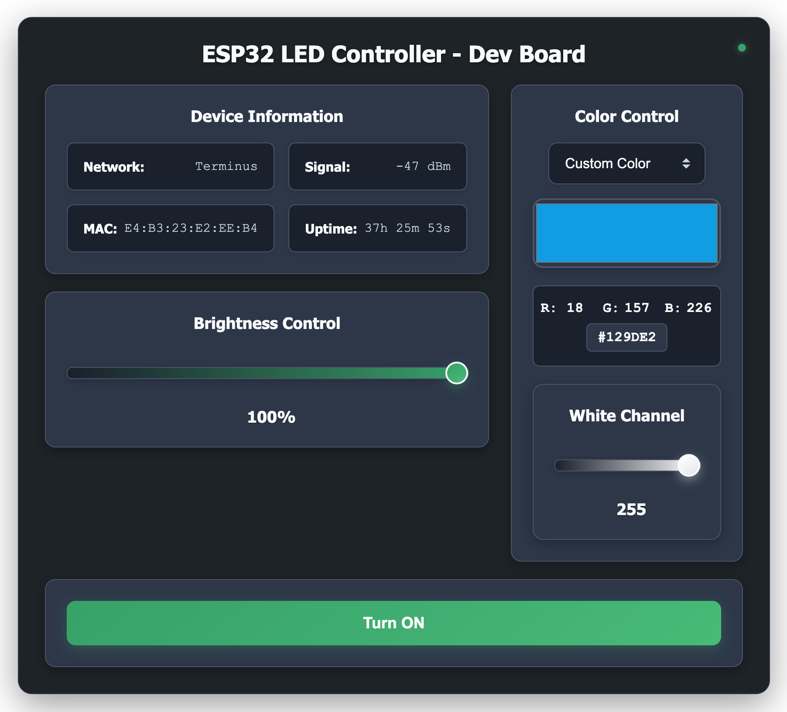

# ESP32 LED Controller 💡

A custom ESP32-based controller for WS2812B/SK6812 LED strips with web interface and Alexa integration. Perfect for ambient bedroom lighting! 🛏️



## ✨ Features

- 🎨 **Web Interface** - Real-time control via browser
- 🗣️ **Alexa Integration** - Voice control support  
- 🔘 **Physical Buttons** - Manual brightness/mode control
- 🌈 **Multiple Effects** - Rainbow, chase, breathing animations
- 📱 **Custom Colors** - Full RGB color picker
- 🔧 **Two LED Types** - WS2812B (RGB) and SK6812 (RGBW) support

## 📁 Project Structure

```
esp32-led-controller/
├── code/
│   ├── esp32-ws2812b/          # WS2812B (RGB) version
│   │   ├── data/               # Web interface files
│   │   │   ├── index.html      # Main web UI
│   │   │   ├── style.css       # Styling
│   │   │   └── app.js          # JavaScript controls
│   │   └── esp32-ws2812b.ino   # Arduino sketch
│   └── esp32-sk6812/           # SK6812 (RGBW) version
│       ├── data/               # Web interface files  
│       └── esp32-sk6812.ino    # Arduino sketch
├── kicad/                      # PCB design files
├── gerbers/                    # Manufacturing files
├── datasheets/                 # Component datasheets
└── assets/                     # Board photos
```

## 🚀 Quick Start

### Prerequisites

1. **Arduino IDE** with ESP32 support
2. **Required Libraries:**
   - FastLED (for WS2812B) or Adafruit NeoPixel (for SK6812)
   - FauxmoESP (Alexa integration)
   - AsyncTCP & ESPAsyncWebServer (ESP32 versions)
   - LittleFS (file system)

### Installation

1. **Add ESP32 Board Support:**
   ```
   File → Preferences → Additional Board Manager URLs:
   https://raw.githubusercontent.com/espressif/arduino-esp32/gh-pages/package_esp32_index.json
   ```

2. **Board Configuration:**
   - Board: "ESP32S3 Dev Module"
   - Flash Size: "8MB"
   - Partition Scheme: "8M with spiffs (3MB APP/1.5MB SPIFFS)"

3. **Install Libraries** via Library Manager

4. **Choose Your LED Type:**
   - `esp32-ws2812b/` for standard RGB strips
   - `esp32-sk6812/` for RGBW strips with dedicated white channel

### Upload Process

1. **Configure Settings** in the `.ino` file:
   ```cpp
   const char* ssid = "Your_WiFi_Network";
   const char* password = "Your_WiFi_Password"; 
   #define DEVICE_NAME "Bedroom Lights"
   #define NUM_LEDS 60  // Your LED count
   ```

2. **Upload Web Files:**
   - Install [Arduino LittleFS Upload](https://github.com/earlephilhower/arduino-littlefs-upload) plugin
   - Place the `data` folder in your sketch directory 
   - Use: Cmd + Shift + P, then select "Upload LittleFS to Pico/ESP8266/ESP32"

3. **Upload Arduino Sketch** normally

## 🔌 Hardware Connections

| ESP32 Pin | Connection |
|-----------|------------|
| GPIO 2    | LED Strip Data |
| GPIO 17   | Status LED (Red) |
| GPIO 16   | Status LED (Green) |
| GPIO 18   | Status LED (Blue) |
| GPIO 4-7  | Control Buttons |

## 🌐 Usage

After successful upload:

1. **WiFi Connection:** Board flashes blue → yellow (5x) when connected
2. **Web Interface:** Visit `http://[ESP32_IP]:8080`



3. **Alexa:** Say "Alexa, turn on bedroom lights"
4. **Buttons:** Physical controls for power/brightness/modes

## 🎛️ Controls

- **Power Button:** Long press (0.5s) to toggle on/off
- **Brightness:** ± buttons adjust in 10% steps
- **Mode Button:** Cycle through colors and effects
- **Web Interface:** Real-time RGB control and effects

## 📖 Blog Post

Read the full build story and PCB design process: [ESP32 LED Controller](https://arkandas.com/blog/esp32_led_controller)

## ⚡ Hardware

Custom PCB design includes:
- ESP32-S3-WROOM-1 (8MB Flash)
- SN74AHCT125 level shifter (3.3V → 5V)
- LM1117S-3.3 voltage regulator
- Common anode status LED
- 4 control buttons
- 2.5mm barrel jack power input

## 🛠️ Development

The web interface uses vanilla JavaScript with no external dependencies. All files are served from ESP32's LittleFS for fast loading and offline operation.

## 📄 License

This project is licensed under the MIT License - see the [LICENSE](LICENSE) file for details. 