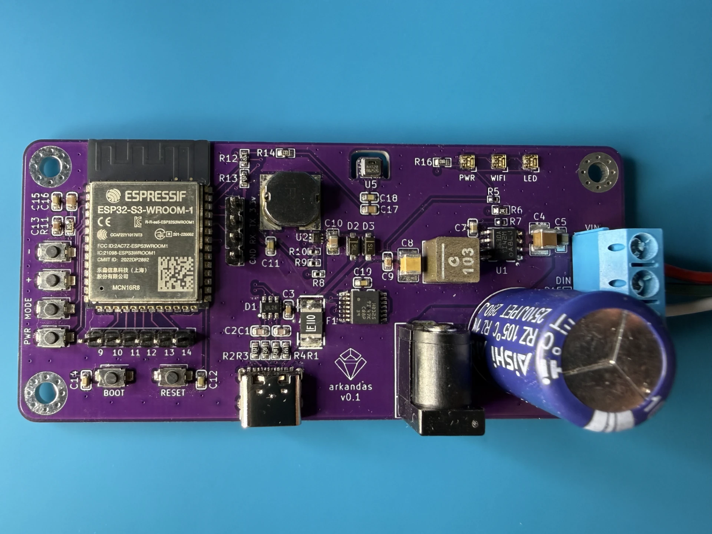
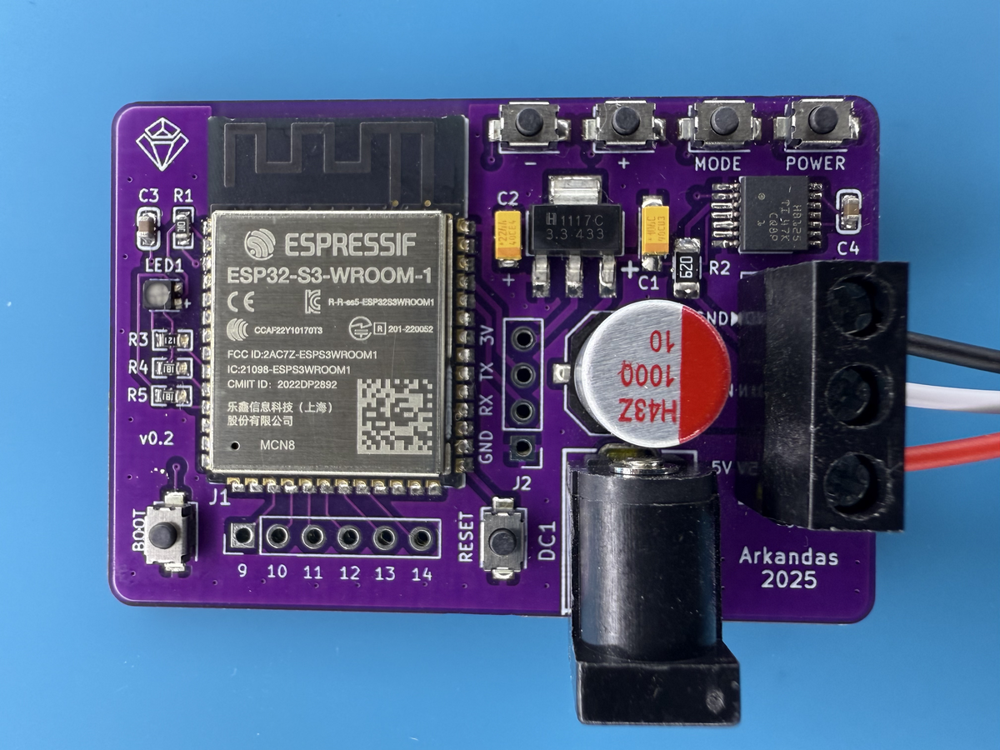
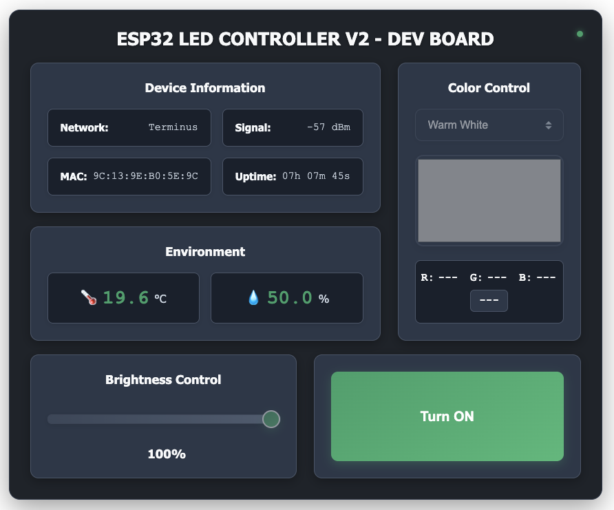
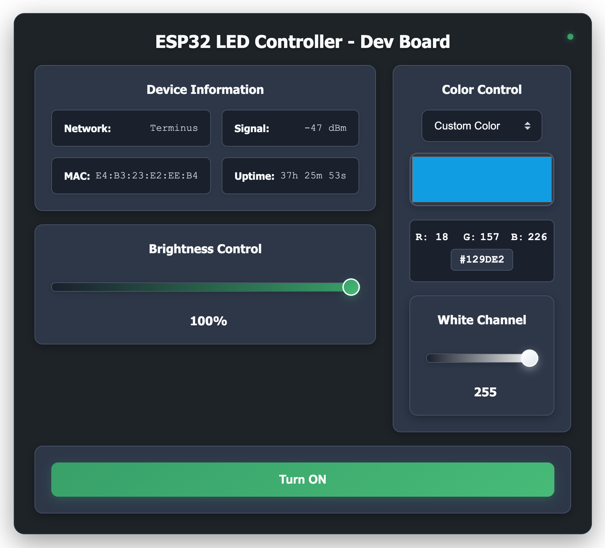

# ESP32 LED Controller 💡

A custom ESP32-based controller for WS2812B/SK6812/WS2814 LED strips with web interface and Alexa integration.

> **Latest Version:** V2 includes 24V RGBW support (WS2814), temperature/humidity monitoring, and enhanced status LEDs.

## Versions

### Version 2
✅ Released - Latest version in `main` branch



### Version 1
✅ Released - Tagged as `v1.0.0`



---

## Version 2 Documentation

The following documentation applies to **Version 2** of the project. All files are located in the `v2/` directory.

### ✨ Features

- 🎨 **Web Interface** - Real-time control with environment monitoring
- 🗣️ **Alexa Integration** - Voice control support
- 🔘 **Physical Buttons** - Manual brightness/mode control
- 🌈 **Multiple Effects** - Rainbow, chase, breathing animations
- 📱 **Custom Colors** - Full RGBW color picker
- 🌡️ **Temperature & Humidity** - AHT20 sensor for environment monitoring
- 💡 **Status LEDs** - 3x RGB status indicators (Power, WiFi, Strip)
- ⚡ **24V RGBW Support** - WS2814 LED strips with dedicated white channel

### 📁 Project Structure

```
v2/
├── code/                      # Arduino code & web interface
│   └── esp32-ws2814/          # WS2814 (RGBW) version
│       ├── data/              # Web interface files
│       │   ├── index.html     # Main web UI
│       │   ├── style.css      # Styling
│       │   └── app.js         # JavaScript controls
│       └── esp32-ws2814.ino   # Arduino sketch
├── kicad/                     # KiCad PCB project files
└── assets/                    # Board photos & schematics
```

### 🚀 Quick Start

#### Prerequisites

1. **Arduino IDE** with ESP32 support
2. **Required Libraries:**
   - Adafruit NeoPixel (for WS2814 RGBW)
   - FastLED (for status LEDs)
   - FauxmoESP (Alexa integration)
   - AsyncTCP & ESPAsyncWebServer (ESP32 versions)
   - LittleFS (file system)
   - Adafruit AHTX0 (temperature sensor)

#### Installation

1. **Add ESP32 Board Support:**
   ```
   File → Preferences → Additional Board Manager URLs:
   https://raw.githubusercontent.com/espressif/arduino-esp32/gh-pages/package_esp32_index.json
   ```

2. **Board Configuration:**
   - Board: "ESP32S3 Dev Module"
   - Flash Size: "8MB"
   - Partition Scheme: "8M with spiffs (3MB APP/1.5MB SPIFFS)"

3. **Install Libraries** via Library Manager

#### Upload Process

1. **Configure Settings** in the `.ino` file:
   ```cpp
   const char* ssid = "Your_WiFi_Network";
   const char* password = "Your_WiFi_Password";
   #define DEVICE_NAME "Your_Alexa_Device_Name"
   #define WIFI_HOSTNAME "Your_Device_Hostname"
   #define WEB_SERVER_PORT 8080  // Your preferred port
   #define NUM_LEDS 60  // Your LED count
   ```

2. **Upload Web Files:**
   - Install [Arduino LittleFS Upload](https://github.com/earlephilhower/arduino-littlefs-upload) plugin
   - Place the `data` folder in your sketch directory
   - Use: Cmd + Shift + P, then select "Upload LittleFS to Pico/ESP8266/ESP32"

3. **Upload Arduino Sketch** normally

#### Programming via USB

The v2 board uses an **ESP32-S3** with built-in USB - no need for an external USB-to-serial adapter.

**USB Connection:**
- Connect a USB-C cable directly to the ESP32-S3's USB port
- The board will show up as a serial device on your computer

**Arduino IDE USB Configuration:**

To get USB UART working on the Serial Monitor:

1. **Board Settings (Tools menu):**
   - Board: `ESP32S3 Dev Module`
   - USB CDC On Boot: `Enabled` ⚠️ **Important for Serial Monitor**
   - USB Mode: `Hardware CDC and JTAG`
   - Upload Mode: `UART0 / Hardware CDC`
   - Flash Size: `8MB`
   - Partition Scheme: `8M with spiffs (3MB APP/1.5MB SPIFFS)`
   - Upload Speed: `921600` (or lower if uploads fail)

2. **Port Selection:**
   - After connecting USB, select the port showing as ESP32-S3 in Tools → Port
   - macOS: Usually appears as `/dev/cu.usbmodem*`
   - Windows: Usually appears as `COM*`
   - Linux: Usually appears as `/dev/ttyACM*`

**USB CDC On Boot Explained:**
- When `Enabled`, the Serial Monitor will work over USB immediately after boot
- This allows you to see debug output using `Serial.println()` without additional hardware
- The board will enumerate as a USB serial device (CDC - Communications Device Class)

**First-Time Programming:**
1. Connect the board via USB-C
2. The ESP32-S3 should automatically enter bootloader mode when uploading
3. If upload fails, try:
   - Press and hold the `BOOT` button (if available on your board)
   - Click Upload in Arduino IDE
   - Release `BOOT` button when upload starts
4. Open Serial Monitor (Ctrl/Cmd + Shift + M) at `115200` baud to see output

**Troubleshooting:**
- **Port not appearing:** Try a different USB cable (must support data, not just power)
- **Upload fails:** Lower the upload speed to `460800` or `115200`
- **Serial Monitor shows gibberish:** Ensure baud rate is set to `115200` and USB CDC On Boot is enabled

### 🔌 Hardware Connections

| ESP32 Pin | Connection |
|-----------|------------|
| GPIO 40   | WS2814 LED Strip Data |
| GPIO 41   | Status LEDs (3x SK6805-EC20) |
| GPIO 1    | I2C SCL (AHT20 Sensor) |
| GPIO 2    | I2C SDA (AHT20 Sensor) |
| GPIO 4-7  | Control Buttons |

### 🌐 Usage

After successful upload:

1. **WiFi Connection:** Status LEDs flash yellow (5x) when connected
2. **Web Interface:** Visit `http://[ESP32_IP]:8080` (or your configured port)



3. **Alexa:** Say "Alexa, turn on [your device name]"
4. **Buttons:** Physical controls for power/brightness/modes

### 🎛️ Controls

- **Power Button:** Long press (0.5s) to toggle on/off
- **Brightness:** ± buttons adjust in 10% steps
- **Mode Button:** Cycle through colors and effects
- **Web Interface:** Real-time RGBW control, effects, and environment monitoring

### 💡 Status LEDs

The board features 3 RGB status LEDs:
- **LED 1 (Power):** Always green when powered
- **LED 2 (WiFi):** Green when connected, Red when disconnected, Yellow during errors
- **LED 3 (Strip):** Green when strip is on, Red when off

### ⚡ Hardware

Custom PCB design includes:
- ESP32-S3-WROOM-1 (8MB Flash)
- SN74AHCT125 level shifter (3.3V → 5V for WS2814)
- LM1117S-3.3 voltage regulator
- 3x SK6805-EC20 RGB status LEDs
- AHT20 temperature & humidity sensor
- 4 control buttons
- 2.5mm barrel jack power input (24V for WS2814)

### 🔧 Key Differences from V1

- **RGBW Support:** Dedicated white channel for better white light quality
- **24V LED Strips:** Uses WS2814 instead of WS2812B/SK6812
- **Environment Monitoring:** Built-in AHT20 temperature and humidity sensor
- **Improved Status LEDs:** 3x addressable RGB LEDs instead of single common anode LED
- **Enhanced Web Interface:** Shows temperature, humidity, and more device information
- **Configurable Port:** Web server port can be customized

---

## Version 1 Documentation

The following documentation applies to **Version 1** of the project. All files are located in the `v1/` directory.

### ✨ Features

- 🎨 **Web Interface** - Real-time control via browser
- 🗣️ **Alexa Integration** - Voice control support
- 🔘 **Physical Buttons** - Manual brightness/mode control
- 🌈 **Multiple Effects** - Rainbow, chase, breathing animations
- 📱 **Custom Colors** - Full RGB color picker
- 🔧 **Two LED Types** - WS2812B (RGB) and SK6812 (RGBW) support

### 📁 Project Structure

```
v1/
├── code/                       # Arduino code & web interface
│   ├── esp32-ws2812b/          # WS2812B (RGB) version
│   │   ├── data/               # Web interface files
│   │   │   ├── index.html      # Main web UI
│   │   │   ├── style.css       # Styling
│   │   │   └── app.js          # JavaScript controls
│   │   └── esp32-ws2812b.ino   # Arduino sketch
│   └── esp32-sk6812/           # SK6812 (RGBW) version
│       ├── data/               # Web interface files
│       └── esp32-sk6812.ino    # Arduino sketch
├── kicad/                      # KiCad PCB project files
├── gerbers/                    # Manufacturing files
├── datasheets/                 # Component datasheets
├── ibom/                       # Interactive BOM
└── assets/                     # Board photos
```

### 🚀 Quick Start

#### Prerequisites

1. **Arduino IDE** with ESP32 support
2. **Required Libraries:**
   - FastLED (for WS2812B) or Adafruit NeoPixel (for SK6812)
   - FauxmoESP (Alexa integration)
   - AsyncTCP & ESPAsyncWebServer (ESP32 versions)
   - LittleFS (file system)

#### Installation

1. **Add ESP32 Board Support:**
   ```
   File → Preferences → Additional Board Manager URLs:
   https://raw.githubusercontent.com/espressif/arduino-esp32/gh-pages/package_esp32_index.json
   ```

2. **Board Configuration:**
   - Board: "ESP32S3 Dev Module"
   - Flash Size: "8MB"
   - Partition Scheme: "8M with spiffs (3MB APP/1.5MB SPIFFS)"

3. **Install Libraries** via Library Manager

4. **Choose Your LED Type:**
   - `v1/code/esp32-ws2812b/` for standard RGB strips
   - `v1/code/esp32-sk6812/` for RGBW strips with dedicated white channel

#### Upload Process

1. **Configure Settings** in the `.ino` file:
   ```cpp
   const char* ssid = "Your_WiFi_Network";
   const char* password = "Your_WiFi_Password";
   #define DEVICE_NAME "Bedroom Lights"
   #define NUM_LEDS 60  // Your LED count
   ```

2. **Upload Web Files:**
   - Install [Arduino LittleFS Upload](https://github.com/earlephilhower/arduino-littlefs-upload) plugin
   - Place the `data` folder in your sketch directory
   - Use: Cmd + Shift + P, then select "Upload LittleFS to Pico/ESP8266/ESP32"

3. **Upload Arduino Sketch** normally

### 🔌 Hardware Connections

| ESP32 Pin | Connection |
|-----------|------------|
| GPIO 2    | LED Strip Data |
| GPIO 17   | Status LED (Red) |
| GPIO 16   | Status LED (Green) |
| GPIO 18   | Status LED (Blue) |
| GPIO 4-7  | Control Buttons |

### 🌐 Usage

After successful upload:

1. **WiFi Connection:** Board flashes blue → yellow (5x) when connected
2. **Web Interface:** Visit `http://[ESP32_IP]:8080`



3. **Alexa:** Say "Alexa, turn on bedroom lights"
4. **Buttons:** Physical controls for power/brightness/modes

### 🎛️ Controls

- **Power Button:** Long press (0.5s) to toggle on/off
- **Brightness:** ± buttons adjust in 10% steps
- **Mode Button:** Cycle through colors and effects
- **Web Interface:** Real-time RGB control and effects

### 📖 Blog Post

Read the full build story and PCB design process for V1: [ESP32 LED Controller](https://arkandas.com/blog/esp32_led_controller)

### ⚡ Hardware

Custom PCB design includes:
- ESP32-S3-WROOM-1 (8MB Flash)
- SN74AHCT125 level shifter (3.3V → 5V)
- LM1117S-3.3 voltage regulator
- Common anode status LED
- 4 control buttons
- 2.5mm barrel jack power input

### 🛠️ Development

The web interface uses vanilla JavaScript with no external dependencies. All files are served from ESP32's LittleFS for fast loading and offline operation.

## 📄 License

This project is licensed under the MIT License - see the [LICENSE](LICENSE) file for details.
